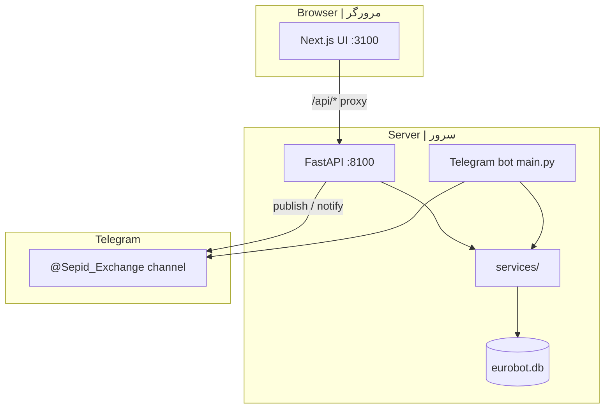

# Sepid Exchange Website

<p align="center">
  <strong>EN:</strong> Web companion for <a href="https://t.me/Sepid_Exchange">@Sepid_Exchange</a> — same DB and business rules as the Telegram bot<br/>
  <strong>FA:</strong> مکمل وب کانال <a href="https://t.me/Sepid_Exchange">@Sepid_Exchange</a> — همان دیتابیس و قوانین ربات<br/>
  <a href="https://github.com/soha15167/Sepid_Exchange_Bot">Telegram bot repo</a> · <a href="https://t.me/Sepid_Group_Bot">@Sepid_Group_Bot</a>
</p>

> **EN:** Bilingual docs (English + Persian). Code search: `Section` or `بخش`. Deal flow: [docs/DEAL_GATE.md](docs/DEAL_GATE.md) · Web details: [docs/WEB_COMPANION.md](docs/WEB_COMPANION.md)  
> **FA:** مستندات دو زبانه. فلو معامله: [docs/DEAL_GATE.md](docs/DEAL_GATE.md) · راهنمای وب: [docs/WEB_COMPANION.md](docs/WEB_COMPANION.md)

---

## Table of contents | فهرست

| # | EN | FA |
|---|----|----|
| 1 | [Introduction](#introduction--معرفی) | معرفی |
| 2 | [Tech stack](#tech-stack--زبان‌ها-و-فناوری) | فناوری |
| 3 | [Features](#features--قابلیت‌ها) | قابلیت‌ها |
| 4 | [Architecture](#architecture--معماری) | معماری |
| 5 | [Project structure](#project-structure--ساختار-پروژه) | ساختار |
| 6 | [Install & run](#install--run--نصب-و-اجرا) | نصب |
| 7 | [Deploy](#deploy--دیپلوی) | دیپلوی |
| 8 | [API overview](#api-overview--خلاصه-api) | API |
| 9 | [Security](#security--امنیت) | امنیت |
| 10 | [Related repos](#related-repos--ریپوهای-مرتبط) | ریپوها |

---

## Introduction | معرفی

### English

**Sepid Exchange Website** is the browser companion to the official Telegram bot. Users can register, post euro buy/sell and exchange ads, browse the channel catalogue, submit offers, and continue **Deal Gate** steps (final confirmation, bank accounts) from the dashboard. Admins get a web panel mirroring the bot admin menu.

The stack shares **one SQLite database** and **one `.env`** with the bot. Publishing an ad from the web posts to the same Telegram channel; offers and deal gates behave like the bot.

### فارسی

**وب سپید اکسچنج** مکمل مرورگری ربات رسمی است: ثبت‌نام، ثبت آگهی خرید/فروش/معاوضه یورو، مرور آگهی‌های کانال، پیشنهاد، و ادامه **دروازه معامله** (تأیید نهایی، حساب بانکی) از داشبورد. ادمین‌ها پنل وب با همان منوی ربات دارند.

وب و ربات **یک دیتابیس** و **یک `.env`** مشترک دارند. انتشار آگهی از وب همان کانال تلگرام را به‌روز می‌کند؛ پیشنهادها و gate مثل ربات عمل می‌کنند.

---

## Tech stack | زبان‌ها و فناوری

| Layer | EN | FA | Path |
|-------|----|----|------|
| UI | Next.js 14, React 18, Tailwind | رابط کاربری | `web/` |
| API | FastAPI, Uvicorn, JWT | API وب | `web_api/` |
| Business | Python services (shared with bot) | منطق مشترک | `services/` |
| DB | SQLite via `database/db.py` | دیتابیس | `database/` |
| Bot runtime | python-telegram-bot (unchanged) | ربات | `main.py`, `handlers/` |

**Ports (production):**

| Service | Port | systemd unit |
|---------|------|----------------|
| Web API | **8100** | `sepid-web-api` |
| Web UI | **3100** | `sepid-web-ui` |
| Telegram bot | — | `telegram-bot` (separate process) |

**Main Python libs (API):** `fastapi`, `uvicorn`, `python-jose`, `bcrypt` — see [requirements-web.txt](requirements-web.txt).  
**Main Node libs:** `next`, `react`, `tailwindcss` — see [web/package.json](web/package.json).

---

## Features | قابلیت‌ها

| Area | EN | FA |
|------|----|----|
| Auth | Phone/email OTP, password login, link existing bot user | OTP، ورود، اتصال کاربر ربات |
| Adverts | Euro buy/sell wizard, exchange wizard, channel publish | ویزارد آگهی، انتشار کانال |
| Channel gate | Must join `@Sepid_Exchange` before publish | عضویت کانال قبل از ثبت |
| Offers | Submit, edit rate, withdraw; owner accept/reject | پیشنهاد، پذیرش/رد |
| Deal Gate (web) | Party yes/no, account text; receipts still in bot | تأیید نهایی و حساب در وب |
| Public UI | Advert cards with public offers (channel parity) | پیشنهادهای عمومی روی کارت |
| Admin web | Users, adverts, offers, negotiations, deal list, proxy offer, Bonbast, bot restart | پنل ادمین |
| Mobile | Responsive layout, 16px inputs (no iOS zoom) | موبایل |

---

## Architecture | معماری



**EN:** The UI calls `/api/*` (proxied to port 8100 in dev/production). The API imports bot modules for publishing, offers, and deal gate — no duplicate business logic.

**FA:** UI به `/api` درخواست می‌زند. API ماژول‌های ربات را import می‌کند تا منطق تکراری نباشد.

---

## Project structure | ساختار پروژه

```text
Sepid_Exchange_Wesite/          # this repo | همین ریپو
├── web/                        # Next.js UI → deploy to /root/web
│   └── src/
│       ├── app/                # pages (dashboard, auth, adverts, admin)
│       └── components/         # wizards, DealGatePanel, AdminPanel
├── web_api/                    # FastAPI → runs beside bot
│   ├── main.py
│   └── routers/                # auth, adverts, offers, admin, info
├── services/                   # shared business logic
│   ├── advert_publish.py
│   ├── deal_gate_web.py
│   ├── channel_membership_web.py
│   └── admin_web.py
├── database/                   # SQLite + web_auth.py
├── handlers/                   # bot handlers (API reuses deal_gate, offers)
├── deploy/                     # systemd + nginx example
│   ├── sepid-web-api.service
│   ├── sepid-web-ui.service
│   └── nginx-sepid.conf
├── docs/
│   ├── WEB_COMPANION.md
│   ├── DEAL_GATE.md
│   └── BOT_README.md           # full bot documentation
├── scripts/
│   ├── run_web_api.py
│   └── server_start_web.sh
├── requirements-web.txt
└── .env.sepid.example          # copy to .env on server
```

---

## Install & run | نصب و اجرا

### English

**Requirements:** Python 3.10+, Node 18+, running bot `.env` with `BOT_TOKEN`, `ADVERT_CHANNEL_ID`, Twilio (OTP), `WEB_JWT_SECRET`.

**FA:** پایتون ۳.۱۰+، Node ۱۸+، فایل `.env` ربات با توکن و Twilio.

```bash
git clone https://github.com/soha15167/Sepid_Exchange_Wesite.git
cd Sepid_Exchange_Wesite

# Python API (use same venv as bot or create one)
python -m venv venv
source venv/bin/activate          # Windows: venv\Scripts\activate
pip install -r requirements.txt
pip install -r requirements-web.txt
cp .env.sepid.example .env        # edit tokens / secrets

# Database schema (safe with bot running)
python -c "from database.db import ensure_schema; ensure_schema()"

# API
python scripts/run_web_api.py     # http://127.0.0.1:8100/api/health

# UI
cd web
npm install
npm run dev                       # http://127.0.0.1:3100
```

### Key env variables | متغیرهای مهم

| Variable | EN | FA |
|----------|----|----|
| `BOT_TOKEN` | Telegram bot (publish + deal notifications) | توکن ربات |
| `ADVERT_CHANNEL_ID` | Channel for ads + membership check | کانال آگهی |
| `WEB_JWT_SECRET` | JWT signing secret | رمز JWT |
| `WEB_API_PORT` | Default `8100` | پورت API |
| `WEB_DEV_OTP_IN_RESPONSE` | Dev: return OTP in JSON | OTP در پاسخ dev |
| `WEB_FRONTEND_URL` | CORS / links | آدرس فرانت |
| `BOT_RESTART_COMMAND` | Admin web restart (optional) | ری‌استارت ربات |

See also [docs/WEB_COMPANION.md](docs/WEB_COMPANION.md).

---

## Deploy | دیپلوی

**Server example:** `root@49.13.132.230`

| Path | Role |
|------|------|
| `/root/telegram_bot_project2` | Bot + API + DB + `.env` |
| `/root/web` | Next.js build (UI only) |

### systemd

```bash
cp deploy/sepid-web-api.service /etc/systemd/system/
cp deploy/sepid-web-ui.service /etc/systemd/system/
systemctl daemon-reload
systemctl enable --now sepid-web-api sepid-web-ui
```

### After code update | بعد از به‌روزرسانی

```bash
cd /root/telegram_bot_project2
./venv/bin/python3 -c "from database.db import ensure_schema; ensure_schema()"
systemctl restart sepid-web-api

cd /root/web
npm run build
systemctl restart sepid-web-ui
```

### HTTPS (optional) | nginx

```bash
cp deploy/nginx-sepid.conf /etc/nginx/sites-available/sepid
# edit server_name, then:
nginx -t && systemctl reload nginx
certbot --nginx -d your-domain.example
```

Details: [deploy/README.md](deploy/README.md).

### SCP from Windows | انتقال از ویندوز

**API + shared code → `/root/telegram_bot_project2/`**

```text
scp "C:\Users\Sohei\Desktop\Desktop\telegram_bot_project2\web_api\routers\adverts.py" "root@49.13.132.230:/root/telegram_bot_project2/web_api/routers/"
scp "C:\Users\Sohei\Desktop\Desktop\telegram_bot_project2\services\deal_gate_web.py" "root@49.13.132.230:/root/telegram_bot_project2/services/"
```

**UI → `/root/web/`**

```text
scp "C:\Users\Sohei\Desktop\Desktop\telegram_bot_project2\web\src\components\DealGatePanel.tsx" "root@49.13.132.230:/root/web/src/components/"
```

Full tree copy: `scp -r web/* root@49.13.132.230:/root/web/`

---

## API overview | خلاصه API

Base URL: `http://host:8100/api`

| Route | EN |
|-------|-----|
| `POST /auth/*` | Register, login, OTP |
| `GET /adverts` | Public advert list |
| `POST /adverts` | Create euro ad (channel membership required) |
| `POST /adverts/exchange` | Create exchange ad |
| `GET /offers/mine` | My offers |
| `POST /offers/{id}/accept` | Owner accept → starts Deal Gate |
| `GET /deals/{offer_id}` | Deal Gate status |
| `POST /deals/{offer_id}/response` | Party yes/no |
| `POST /deals/{offer_id}/accounts` | Submit account text |
| `GET /admin/*` | Admin panel (JWT + admin id) |

OpenAPI: `http://127.0.0.1:8100/docs` when API is running.

---

## Security | امنیت

**EN:** Never commit `.env`, `*.db`, or JWT secrets. Phone numbers must use international `+` format. Production OTP via Twilio; disable `WEB_DEV_OTP_IN_RESPONSE` on public servers.

**FA:** `.env` و دیتابیس را commit نکنید. شماره با `+` بین‌المللی. در production OTP واقعی؛ `WEB_DEV_OTP_IN_RESPONSE` را خاموش کنید.

---

## Related repos | ریپوهای مرتبط

| Repo | EN | FA |
|------|----|----|
| [Sepid_Exchange_Bot](https://github.com/soha15167/Sepid_Exchange_Bot) | Telegram bot (primary) | ربات تلگرام |
| **This repo** | Web UI + API companion | وب + API |
| [docs/BOT_README.md](docs/BOT_README.md) | Full bot documentation | مستندات کامل ربات |

---

## License | لایسنس

**EN:** Private project — no public use without permission.

**FA:** پروژه خصوصی — استفاده بدون اجازه مجاز نیست.
